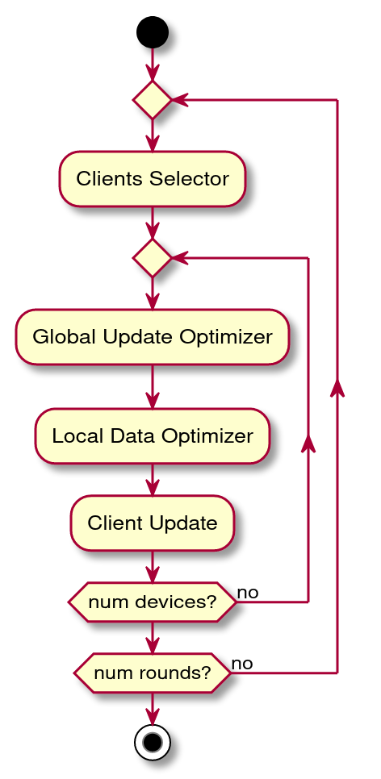

# Federated Learning Simulator
A [Federated Learning](https://arxiv.org/abs/1602.05629) simulator with device availability, failures, computation, network, local data and energy heterogeneity simulation.

The goal of this simulator is to execute an FL algorithm, such as FedAvg, in a real FL scenario, i.e., many
heterogeneous devices, with different computation, network, energy capabilities and local data availability.
The simulator aims to allow the developer to test and analyze custom optimizers.
Optimizers are logic blocks that can be plugged in the simulator and can control the
FL algorithm during its execution.

The simulator provides an **Analyzer** component that allows to plot and visualize the simulation data.

### Setup
```
virtualenv env
pip install -r requirements.txt
```

#### Simulator
Set the simulation parameters (described below) in the ```config.py``` file or with environment variables 
and start the simulation, e.g., ```export FL_OUT_FILE="base.json" && export FL_SEL_F="random" && python simulate.py```.
The output of the simulation will be saved in the ```output``` folder by default.

#### Analyzer
The **Analyzer** can be started with ```python analyze.py -f <list of files to analyze>```. The files are read from the 
```output``` folder and the resulting plots are saved to the ```graphs``` folder by default.

## FL phases
The model is trained during the **fit** phase and evaluated during the **eval** phase.
During the fit phase the model is trained locally, the resulting weights are aggregated and the global model is updated.
During the eval phase the model is evaluated locally, the resulting losses and accuracies are aggregated to compute how
well the model is performing.

### Optimizers
The simulator is designed to test different optimizers in a real FL scenario. Optimizers are algorithms that
are executed during the FL protocol 

The execution of the optimizers is sketched in the following image:


Starting from the original ***FedAvg*** protocol, it is possible to control the training process
with the following optimizers:

### Clients Selector
The **Client Selector** computes the fraction of selected clients (param ***k***) and selects the devices that
will be used for the fit and eval phases.

The **Client Selector** must implement the ***select_devices*** method that receives the current number of round
and return a list with the selected devices indexes. The selector may use the current status of the system.
```
def select_devices(self, num_round: int) -> List
```

##### Random Selector
The **Random Selector** randomly select devices among the available ones. 

### Global Update Optimizer
The **Global Update Optimizer** computes ```epochs``` (E), ```batch_size``` (B) and ```num_examples``` (N) so the
amount of computation performed locally by each devices. The configuration can be different for every elected device.

The **Global Update Optimizer** must implement the ***optimize*** method that given a round and a device index
return the update configuration, as a dict:
```
def optimize(self, r: int, dev_index: int, phase: str) -> dict:
```

Example of returned configuration:
```
{"epochs": self.epochs, "batch_size": self.batch_size, "num_examples": self.num_examples}
```

##### Static Optimizer
The **Static Optimizer** statically set E, B and N from the given parameters.

### Local Data Optimizer
The **Local Data Optimizer** selects the ```num_examples``` examples used for the local update

The **Local Data Optimizer** must implement the ***optimize*** method that given the number of current round,
the device index, the number of examples from the local update configuration and the available dataset, it returns
a subset data from the local available data, of size min(num_examples, available_examples):
```
def optimize(self, r: int, dev_index: int, num_examples: int, data) -> tuple
```

##### Random Optimizer
The **Random Optimizer** randomly selects the available examples.

## Simulation Parameters
The simulation parameters defines how the simulation is performed and which are the algorithms used
to perform the FL phases.
- **repetitions**:
    - type: int
    - desc: the number of repetitions for each run
- **simulation_output_folder**:
    - type: str
    - desc: folder where to save the simulation output data
- **simulation_output_file**:
    - type: str
    - desc: file where to save the simulation output data
- **model_name**:
    - type: str
    - desc: the model used for the simulation
    - available values:
        - ```mnist```
        - ```fashion_mnist```
        - ```cifar10```
        - ```imdb_reviews```
- **num_rounds**:
    - type: int
    - desc: the total number of rounds to execute of the FL algorithm
- **aggregation**:
    - type: str
    - desc: the algorithm used for the local update aggregation
    - available values:
        - ```fedavg```
- **selection**:
    - type: str
    - desc: the algorithm used for the clients selection
    - defined for: fit, eval
    - available values:
        - ```random```
- **global_upd_opt**:
    - type: str
    - desc: the algorithm used for the global update optimizer
    - defined for: fit, eval
    - available values:
        - ```static```
- **local_data_opt_fit**:
    - type: str
    - desc: the algorithm used for the local data optimizer
    - defined for: fit, eval    
    - available values:
        - ```random```
- **optimizer**:
    - type: str
    - desc: optimizer used by the local update
    - available values:
        - ```sgd```
        - ```adam```
        - all optimizers provided by TensorFlow
- **random_seed**:
    - type: int
    - desc: random seed can be fixed for reproducibility
- **tf_verbosity**:
    - type: int
    - desc: set the TensorFlow verbosity
    - available values:
        - 0 = silent
        - 1 = progress bar
        - 2 = one line per epoch

### Devices Parameters
In FL devices can join and leave the network at every instant of time. ```num_devs``` defines the total number of
devices that can take part to the network concurrently. A local update of the model on the device can fail,
e.g., the process is stopped by the OS. The availability and failures are modeled with a binomial distribution
with probability ```p_available``` and ```p_fail``` respectively.

- **num_devs**:
    - type: int
    - desc: total number of devices
- **p_available**:
    - type: float
    - desc: probability a device is available for a round
    - available values: [0, 1]
- **p_fail**:
    - type: float
    - desc: probability a device fails during a round
    - available values: [0, 1]


### Local Iterations
The local iterations parameters define how the local updates are performed, i.e., the amount of computation performed
by each device at each round. These parameters are used by static global update optimizers to set the number of
local iterations (epochs * num_examples / batch_size). ```k``` defines the fraction of clients
used for each round. Other update optimizers can compute these values dynamically at runtime. 

- **epochs**:
    - type: int
    - desc: number of epochs executed for each round
- **batch_size**:
    - type: int
    - desc: batch size used for each round
    - defined for: fit, eval
- **num_examples**:
    - type: int
    - desc: number of examples used for each round
    - defined for: fit, eval
- **k**:
    - type: float
    - desc: fraction of clients used for the computation
    - available values: (0, 1]
    - defined for: fit, eval

### Computation
Devices in FL are heterogeneous (e.g. smartphones with different CPUs and memory).
The computation capabilities of each device is modeled through the number of iterations the device
is capable of running per second (IPS).
IPS is taken from a uniform distribution between [ips_mean - ips_var, ips_mean + ips_var].
IPS is assumed to be fixed for each device for each round.
The ```ips_var``` defines the heterogeneity of the available devices.
 
- **ips_mean**:
    - type: int
    - desc: mean number of computed iterations/second per device (among devices) [iter/s]
- **ips_var**:
    - type: int
    - desc: ips variance

### Energy
Devices in FL are generally powered by batteries. The available energy capacity is different among devices.
The energy, expressed in mWh, available at each devices is taken from a uniform distribution
between [energy_mean - energy_var, energy_mean + energy_var].
It changes for every device for every round because the devices could be recharged or used for other activities.

- **energy_mean**:
    - type: int
    - desc: mean energy capacity available at each device [mWh]
- **energy_var**:
    - type: int
    - desc: energy variance
    
The amount of energy consumed by computation or network is computed with the following parameters
(assumed to be equal for all the devices): 
- **pow_comp_s**:
    - type: int
    - desc: power consumption for 1 second of computation [mW/s]
- **pow_net_s**:
    - type: int
    - desc: power consumption for 1 second of network used [mW/s]

### Network
Devices in FL are connected to different networks (e.g. WiFI, 3G, 4G, 5G), that provides different capabilities.
The network speed is taken from a uniform distribution
between [netspeed_mean - netspeed_var, netspeed_mean + netspeed_var].
It changes for every device for every round because devices can move at different location and be connected
to different networks.

- **netspeed_mean**:
    - type: int
    - desc: mean network speed available at each device [params/s]
- **netspeed_var**:
    - type: int
    - desc: network speed variance

### Local Data
The size of the data locally available is generally different among devices. While some devices could have a large
dataset other may have a smaller one. The local data size is modeled with a uniform distribution
between [local_data_mean - local_data_var, local_data_mean + local_data_var].
The data set size is assumed to be fixed for each device for each round.

- **local_data_mean**:
    - type: int
    - desc: mean number of examples available at each device [examples]
- **local_data_var**:
    - type: int
    - desc: number of examples variance
- **non_iid_partitions**:
    - type: float
    - desc: if set to 0 the non-iid partitions are not created (and examples will be extracted from the dataset randomly),
    otherwise the partitions will be created as described in [Measuring the Effects of Non-Identical Data Distribution for
    Federated Visual Classification](https://arxiv.org/pdf/1909.06335.pdf). Small values (e.g., 0.1) will create high partitioning while
    bigger values (e.g., 100) will act as random sampling. This parameter indirectly also controls the number of available examples,
    so for some small values the **local_data_mean** and **local_data_var** will be discarded.
