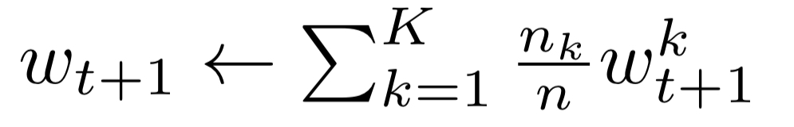
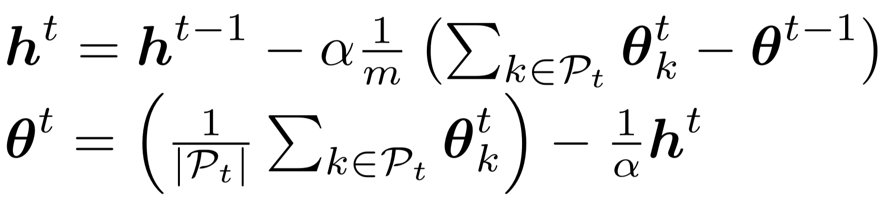

### Aggregation Strategies
Different aggregation strategies are implemented in order to realize the federated algorithms.

#### FedAvg Aggregation Strategy
The **FedAvg Aggregation Strategy** computes a weighted average on the number of examples of the client models.

#### FedNova Aggregation Strategy
The **FedNova Aggregation Strategy** normalizes and scales the local updates of each party according to their number of 
local steps before updating the global model.

#### FedDyn Aggregation Strategy
The **FedDyn Aggregation Strategy** computes the average of the client models and subtracts state h.

