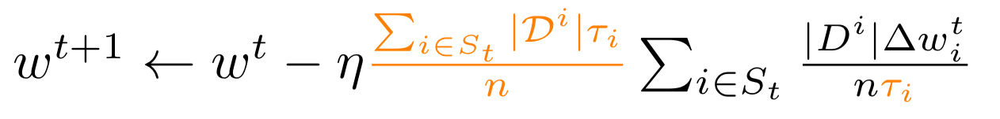

# Aggregation Strategies
The aggregation strategy defines how the local updates, computed by the devices, are aggregated to form the
global model.

**FELES** provides different aggregation strategies in order to realize the federated algorithms:

| name | reference | details |
|---|---|---|
| ``fedavg`` | [McMahan, Brendan, et al. "Communication-efficient learning of deep networks from decentralized data." Artificial intelligence and statistics. PMLR, 2017.](https://arxiv.org/abs/1602.05629) | [FedAvg](#fedavg-aggregation-strategy) |
| ``fednova`` | [Wang, Jianyu, et al. "Tackling the objective inconsistency problem in heterogeneous federated optimization." arXiv preprint arXiv:2007.07481 (2020).](https://arxiv.org/abs/2007.07481) | [FedNova](#fednova-aggregation-strategy) |
| ``feddyn`` | [Acar, Durmus Alp Emre, et al. "Federated learning based on dynamic regularization." arXiv preprint arXiv:2111.04263 (2021).](https://arxiv.org/abs/2111.04263) | [FedDyn](#feddyn-aggregation-strategy) |

---

## FedAvg Aggregation Strategy
The **FedAvg Aggregation Strategy** computes a weighted average on the number of examples of the client models.
- Reference: [Wang, Jianyu, et al. "Tackling the objective inconsistency problem in heterogeneous federated optimization." arXiv preprint arXiv:2007.07481 (2020).](https://arxiv.org/abs/2007.07481)
- Algorithm:

  

## FedNova Aggregation Strategy
The **FedNova Aggregation Strategy** normalizes and scales the local updates of each party according to their number of 
local steps before updating the global model.
- Reference: [Wang, Jianyu, et al. "Tackling the objective inconsistency problem in heterogeneous federated optimization." arXiv preprint arXiv:2007.07481 (2020).](https://arxiv.org/abs/2007.07481)
- Algorithm:

  

## FedDyn Aggregation Strategy
The **FedDyn Aggregation Strategy** computes the average of the client models and subtracts state h.
- Reference: [Acar, Durmus Alp Emre, et al. "Federated learning based on dynamic regularization." arXiv preprint arXiv:2111.04263 (2021).](https://arxiv.org/abs/2111.04263)
- Algorithm:

  

