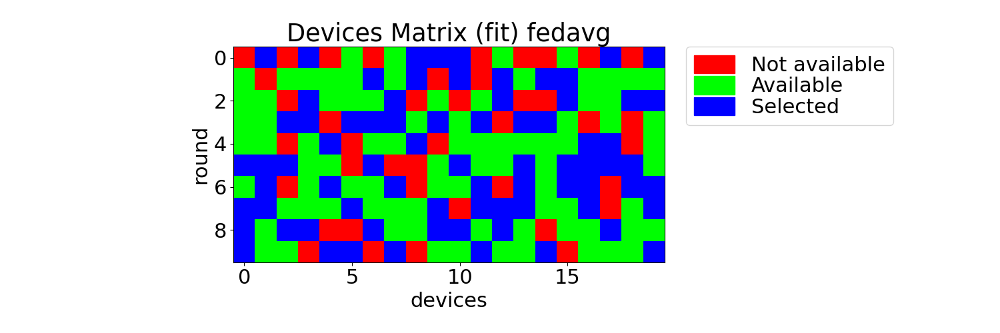

# Analyzer
The analyzer allows to:
- plot graphs
- export a report file (Markdown) with all the graphs
- get information about the execution on the console and in a html file.

### Available graphs
When the simulation is repeated multiple times, the standard deviation is plotted with a vertical line, for every round.

The available graphs are:

| name | details | example |
|---|---|---|
| ``plot_accuracy(phase, color)`` | it shows the aggregated accuracy |  |
| ``plot_loss(phase, color)`` | it shows the aggregated accuracy |  |
| ``plot_computation_time(phase, color)`` | it shows the computation time |  |
| ``plot_communication_time(phase, color)`` | it shows the communication time |    |
| ``plot_total_time(phase, color)`` | it shows the total round time |    |
| ``plot_resources_consumption(phase, color)`` | it shows the resource consumption |    |
| ``plot_network_consumption(phase, color)`` | it shows the network consumption |    |
| ``plot_energy_consumption(phase, color)`` | it shows the energy consumption |  |
| ``plot_available_devices(color)`` | it shows the available devices |  |
| ``plot_selected_devices(phase, color)`` | it shows the selected devices |  |
| ``plot_available_failed_devices(phase, color)`` | it shows the available and failed devices |  |
| ``plot_selected_successful_devices(phase, color)`` | it shows the selected and successful devices |  |
| ``plot_epochs_config(phase, color)`` | it shows the configured epochs |  |
| ``plot_batch_size_config(phase, color)`` | it shows the configured batch size |  |
| ``plot_num_examples_config(phase, color)`` | it shows the configured num examples |  |
| ``plot_matrix_devices(color)`` | it shows the not available, available and selected devices |  |
| ``plot_devices_bar_availability(phase, color)`` | it shows the %of availability of the devices |  |
| ``plot_devices_bar_failures(phase, color)`` | it shows the % of failures of the devices |  |
| ``plot_devices_bar_selected(phase, color)`` | it shows the selected % of the devices |  |
| ``plot_devices_data_size(color)`` | it shows the local data size and density |  |
| ``plot_devices_ips(color)`` | it shows the IPS of the devices and density |  |
| ``plot_devices_available_energy(color)`` | it shows the available energy of the devices and density |  |
| ``plot_devices_network_speed(color)`` | it shows the network speed of the devices and density |  |
| ``plot_devices_data_distribution()`` | it shows the data distribution of classes on the devices |  |
  

### Available print functions

- ```print_availability()```

- ```print_failures()```
  
- ```print_ips()```
    
- ```print_energy()```
    
- ```print_net_speed()```
    
- ```print_local_data_size()```
    
- ```print_model_params()```
    
- ```print_selection(phase)```
     
- ```print_total_time(phase)```
     
- ```print_resources_consumption(phase)```
     
- ```print_energy_consumption(phase)```
     
- ```print_network_consumption(phase)```
     
- ```print_metric(phase, round)```
     
- ```print_loss(phase, round)```