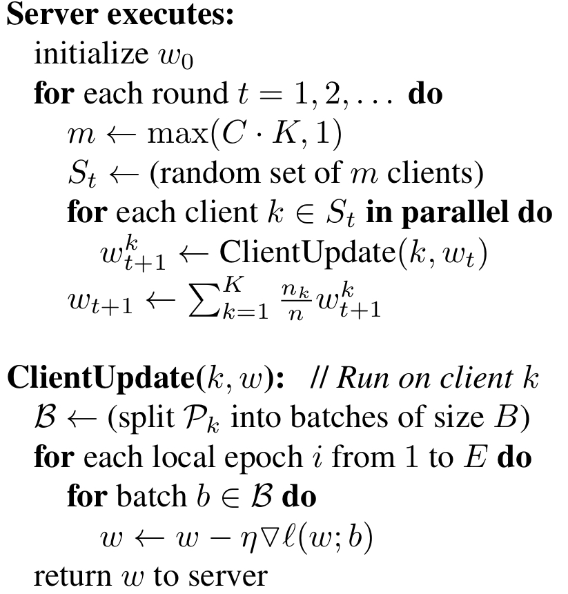
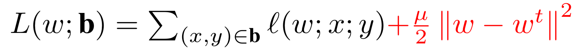
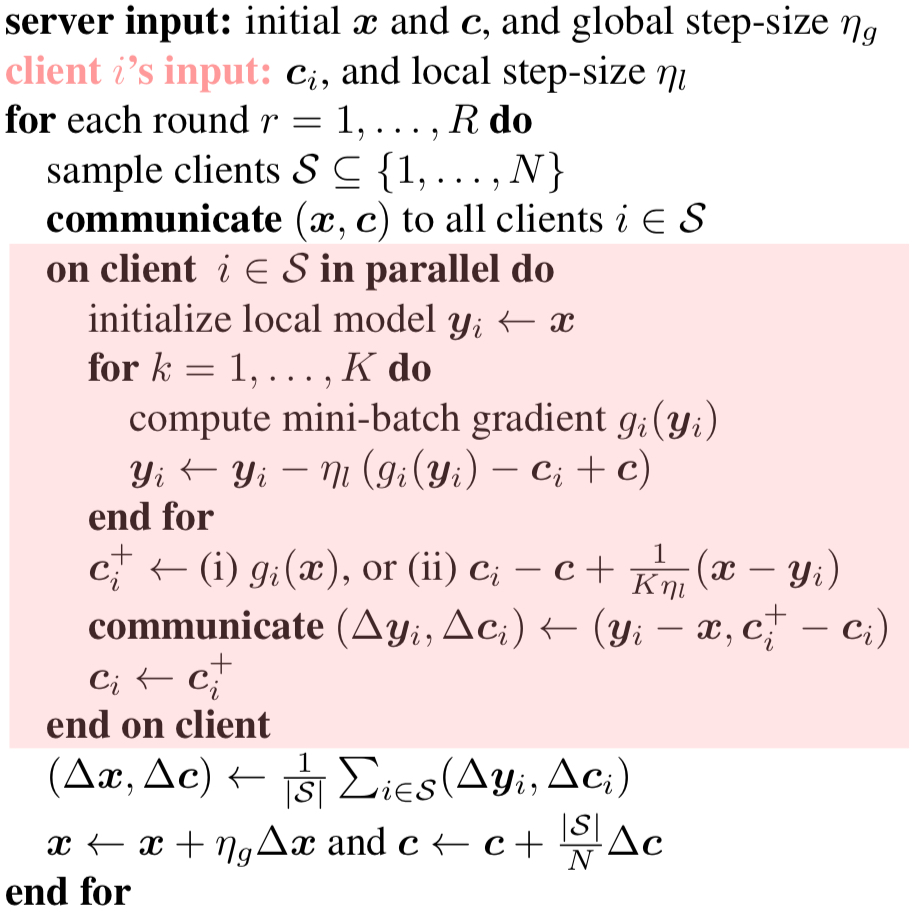

## FL phases
The model is trained during the **fit** phase and evaluated during the **eval** phase.
During the fit phase the model is trained locally, the resulting weights are aggregated and the global model is updated.
During the eval phase the model is evaluated locally, the resulting losses and accuracies are aggregated to compute how
well the model is performing.

## Federated Algorithm
The simulator provides a number of federated algorithms. The basic federated algorithm is FedAvg but each federated algorithm 
implements a personalized version for the worker and the orchestrator by overriding functions. 
Each federated worker can override functions:

- #### handle_fit_job 

- #### handle_eval_job

Each federated orchestrator can override functions:

- #### model_fit

- #### model_eval

- ####select_devs

- ####put_client_job_fit

- #### put_client_job_eval

- #### get_fit_results

- #### get_eval_results

## Available federated algorithms

The algorithms implemented are the followings:

### FedAvg
- Present a practical method for the federated learning of deep networks based on iterative model averaging
- Each client locally takes one step of gradient descent on the current model using its local data, and the server then
takes a weighted average of the resulting models
- Reference: https://arxiv.org/abs/1602.05629

### FedProx
- Introduce a framework, FedProx, to tackle heterogeneity in federated networks
- In highly heterogeneous settings, FedProx demonstrates significantly more stable and accurate convergence behavior relative to FedAvg
- Reference: https://arxiv.org/abs/1812.06127

### FedNova
- Propose FedNova, a normalized averaging method that eliminates objective inconsistency while preserving fast error convergence
- FedNova considers that different parties may conduct different numbers of local steps
- Reference: https://arxiv.org/abs/2007.07481

### SCAFFOLD
- Propose a new algorithm (SCAFFOLD) which uses control variates (variance reduction) to correct for the ‘client-drift’ 
in its local updates
- Prove that SCAFFOLD requires significantly fewer communication rounds and is not affected by data heterogeneity or client sampling
- Can take advantage of similarity in the client’s data yielding even faster convergence
- Reference: https://arxiv.org/abs/1910.06378

### FedDyn
- Propose a dynamic regularizer for each device at each round, so that in the limit the global and device solutions are aligned
- Is fully agnostic to device heterogeneity and robust to large number of devices, partial participation and unbalanced data
- Reference: https://arxiv.org/abs/2111.04263
