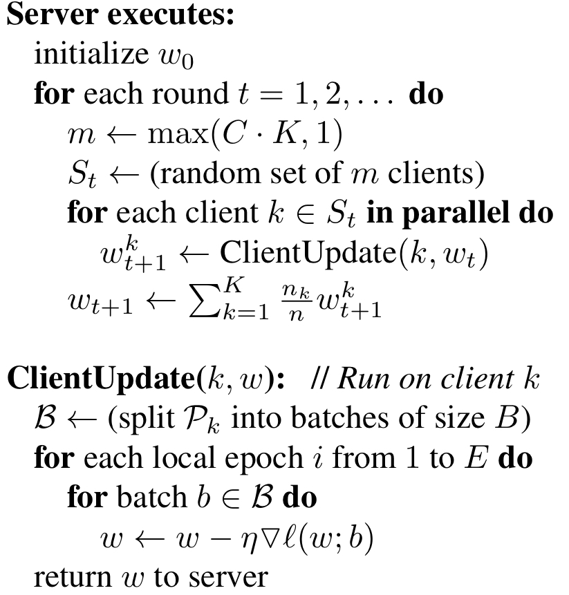
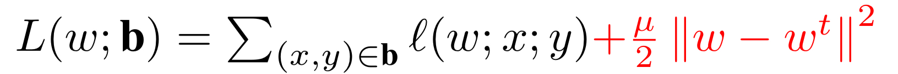
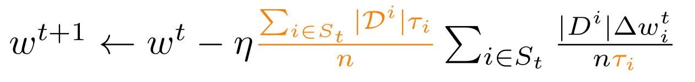
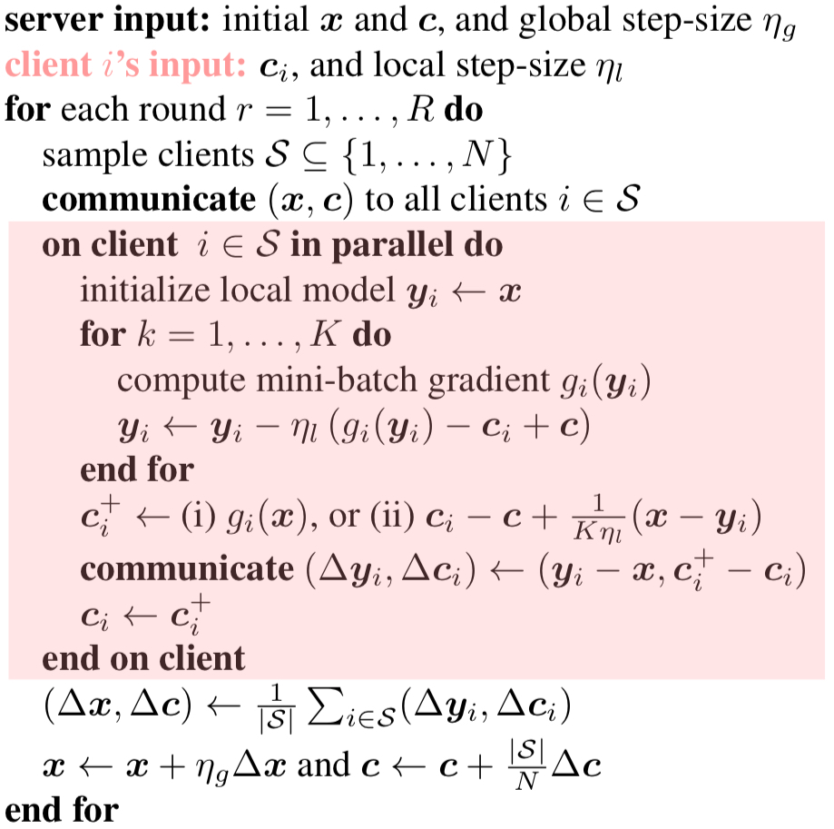
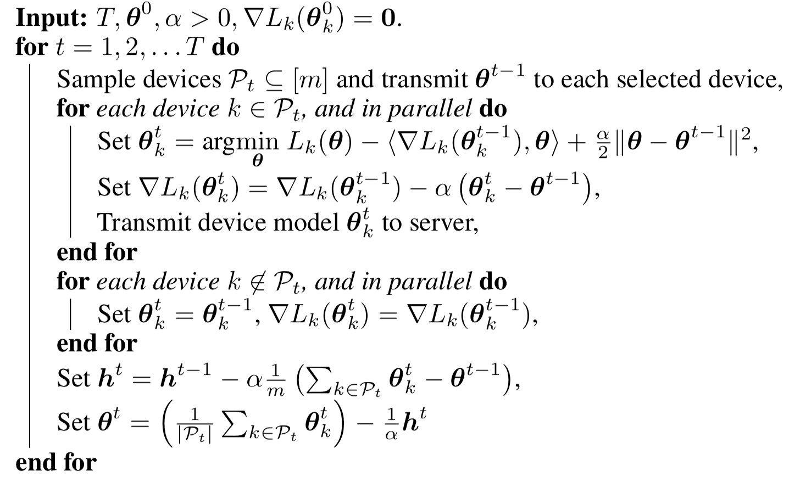

## Federated Algorithms
**FELES** provides a number of federated algorithms ready to be used.

The algorithms implemented in **FELES** are the followings:

| name | reference | details |
|---|---|---|
| ``fedavg`` | [McMahan, Brendan, et al. "Communication-efficient learning of deep networks from decentralized data." Artificial intelligence and statistics. PMLR, 2017.](https://arxiv.org/abs/1602.05629) | [FedAvg](#fedavg) |
| ``fedprox`` | [Li, Tian, et al. "Federated optimization in heterogeneous networks." Proceedings of Machine Learning and Systems 2 (2020): 429-450.](https://arxiv.org/abs/1812.06127) | [FedAvg](#fedavg) |
| ``fednova`` | [Wang, Jianyu, et al. "Tackling the objective inconsistency problem in heterogeneous federated optimization." arXiv preprint arXiv:2007.07481 (2020).](https://arxiv.org/abs/2007.07481) | [FedNova](#fednova) |
| ``scaffold`` | [Karimireddy, Sai Praneeth, et al. "Scaffold: Stochastic controlled averaging for federated learning." International Conference on Machine Learning. PMLR, 2020.](https://arxiv.org/abs/1910.06378) | [SCAFFOLD](#scaffold) |
| ``feddyn`` | [Acar, Durmus Alp Emre, et al. "Federated learning based on dynamic regularization." arXiv preprint arXiv:2111.04263 (2021).](https://arxiv.org/abs/2111.04263) | [FedDyn](#feddyn) |

### Custom Federated Algorithms
The basic federated algorithm is *FedAvg* but each federated algorithm 
implements a personalized version for the worker, and the orchestrator by overriding functions. 

Each federated worker can override functions:
- **handle_fit_job**
- **handle_eval_job**

Each federated orchestrator can override functions:
- **model_fit**
- **model_eval**
- **select_devs**
- **put_client_job_fit**
- **put_client_job_eval**
- **get_fit_results**
- **get_eval_results**

---

## FedAvg
Present a practical method for the federated learning of deep networks based on iterative model averaging
- Description: each client locally takes one step of gradient descent on the current model using its local data, and the server then
takes a weighted average of the resulting models
- Reference: [McMahan, Brendan, et al. "Communication-efficient learning of deep networks from decentralized data." Artificial intelligence and statistics. PMLR, 2017.](https://arxiv.org/abs/1602.05629)
- Algorithm:

  

## FedProx
Introduce a framework, FedProx, to tackle heterogeneity in federated networks
- Description: in highly heterogeneous settings, FedProx demonstrates significantly more stable and accurate
  convergence behavior relative to FedAvg
- Reference: [Li, Tian, et al. "Federated optimization in heterogeneous networks." Proceedings of Machine Learning and Systems 2 (2020): 429-450.](https://arxiv.org/abs/1812.06127)
- Algorithm:

  

## FedNova
FedNova, a normalized averaging method that eliminates objective inconsistency while preserving fast error convergence
- Description: FedNova considers that different parties may conduct different numbers of local steps
- Reference: [Wang, Jianyu, et al. "Tackling the objective inconsistency problem in heterogeneous federated optimization." arXiv preprint arXiv:2007.07481 (2020).](https://arxiv.org/abs/2007.07481)
- Algorithm:

  

## SCAFFOLD
SCAFFOLD uses control variates (variance reduction) to correct for the ‘client-drift’ in its local updates
- Description: SCAFFOLD requires significantly fewer communication rounds and is not affected by
  data heterogeneity or client sampling. Can take advantage of similarity in the client’s data
  yielding even faster convergence
- Reference: [Karimireddy, Sai Praneeth, et al. "Scaffold: Stochastic controlled averaging for federated learning." International Conference on Machine Learning. PMLR, 2020.](https://arxiv.org/abs/1910.06378)
- Algorithm:

  

## FedDyn
FedDyn is a dynamic regularizer for each device at each round, so that the the global and device solutions are aligned
- Description: it is fully agnostic to device heterogeneity and robust to large number of devices,
  partial participation and unbalanced data
- Reference: [Acar, Durmus Alp Emre, et al. "Federated learning based on dynamic regularization." arXiv preprint arXiv:2111.04263 (2021).](https://arxiv.org/abs/2111.04263)
- Algorithm:

  

