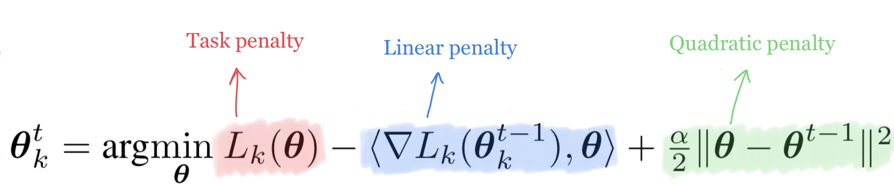

### Loss Functions
Custom loss function are implemented in order to realize the federated algorithms.

#### FedProx Custom Loss
The **FedProx Custom Loss** adds a proximal term to the local function to restrict local updates to be closer to the initial  global model.

#### FedDyn Custom Loss
The **FedDyn Custom Loss** optimizes a local empirical risk objective, which is the sum of its local empirical loss and 
a penalized risk function. The penalized risk, which is dynamically updated, is based on current local device model, 
and the received server model.

