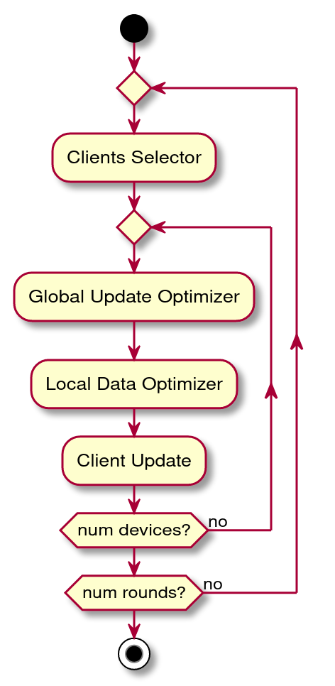

### Optimizers
The simulator is designed to test different optimizers in a real FL scenario. Optimizers are algorithms that
are executed during the FL protocol 

The execution of the optimizers is sketched in the following image:


Starting from the original ***FedAvg*** protocol, it is possible to control the training process
with the following optimizers:

### Clients Selector
The **Client Selector** computes the fraction of selected clients (param ***k***) and selects the devices that
will be used for the fit and eval phases.

The **Client Selector** must implement the ***select_devices*** method that receives the current number of round
and return a list with the selected devices indexes. The selector may use the current status of the system.
```
def select_devices(self, num_round: int) -> List
```

##### Random Selector
The **Random Selector** randomly select devices among the available ones.

##### Best Selector
The **Best Selector** select devices with the highest values of IPS, network speed or energy, among the available ones. 

##### Dynamic Sampling Selector
The [Dynamic Sampling Selector](https://arxiv.org/abs/2003.09603) starts with a high sampling rate at first and 
then decreases the sampling rate during each communication. 
Once a more generalized federated model is trained based on the initialization, the method dynamically decreases 
the number of clients for model aggregation to save communication cost

##### Loss and Fairness Selector
The [Loss and Fairness Selector](https://arxiv.org/abs/2012.08009) is a exploration-exploitation based technique. 
The algorithm performs exploitation by selecting clients with larger local loss as that leads to faster convergence, 
and performs exploration to ensure diversity and achieve a lower error floor.

#### Best Round Time Selector
The **Best Round Time Selector** is built under the assumption that at each round each device provides current 
resources information. By taking advantage of this knowledge it's possible to estimate the round time for each device and 
select devices which are taking the shortest time.

#### Best Expected Time Selector
The **Best Expected Time Selector** allows to select devices as a trade-off between devices which tend to be faster, 
those that tend to have stable resources and those which haven't been selected frequently. It allows to balance
each factor (speed, stability, fairness) by tuning 3 hyperparameters.

#### Budgeted Fairness Rotation Selector
The **Budgeted Fairness Rotation Selector** alternates one round in which fastest devices are selected and one round in which 
devices with biggest loss are selected. In order to guarantee fairness, it's possible to set a desired fairness that should
be kept for the entire simulation. Every time the current fairness is worse than the desired one, the algorithm performs 
a round in which the least selected devices are chosen. 

#### Budgeted Time Rotation Selector
The **Budgeted Fairness Rotation Selector** alternates rounds in which devices with biggest loss are selected and rounds in which 
the least selected devices are chosen. The frequency depends on how the parameters are set. It is also possible to define
a desired average round time to be kept for the simulation, every time the current average round time is higher than the
desired one, then perform one round in which fastests devices are selected.

#### Limited Time Selector
The **Limited Time Selector** allows to define optionally define a time limitation for computation time, communication time
and total time. Once obtained devices which respect time limitations, then select randomly among those devices.

#### Limited Consumption Selector
The **Limited Consumption Selector** selects devices with the biggest loss in the previous round and at the same time allows 
to define a limit of resources, energy and network consumption.

### Global Update Optimizer
The **Global Update Optimizer** computes ```epochs``` (E), ```batch_size``` (B) and ```num_examples``` (N) so the
amount of computation performed locally by each devices. The configuration can be different for every elected device.

The **Global Update Optimizer** must implement the ***optimize*** method that given a round and a device index
return the update configuration, as a dict:
```
def optimize(self, r: int, dev_index: int, phase: str) -> dict:
```

Example of returned configuration:
```
{"epochs": self.epochs, "batch_size": self.batch_size, "num_examples": self.num_examples}
```

##### Static Optimizer
The **Static Optimizer** statically set E, B and N from the given parameters.

##### Uniform Optimizer
The **Uniform Optimizer** generates E, B, N with a uniform distribution in the range specified.

#### Equal Computation Time Optimizer
The **Equal Computation Time Optimizer** generates E, B, N depending on a fixed amount of desired computation
time and the specific ips value for the device. The assumption is that ips is known for each device.

### Local Data Optimizer
The **Local Data Optimizer** selects the ```num_examples``` examples used for the local update

The **Local Data Optimizer** must implement the ***optimize*** method that given the number of current round,
the device index, the number of examples from the local update configuration and the available dataset, it returns
a subset data from the local available data, of size min(num_examples, available_examples):
```
def optimize(self, r: int, dev_index: int, num_examples: int, data) -> tuple
```

##### Random Optimizer
The **Random Optimizer** randomly selects the available examples.
