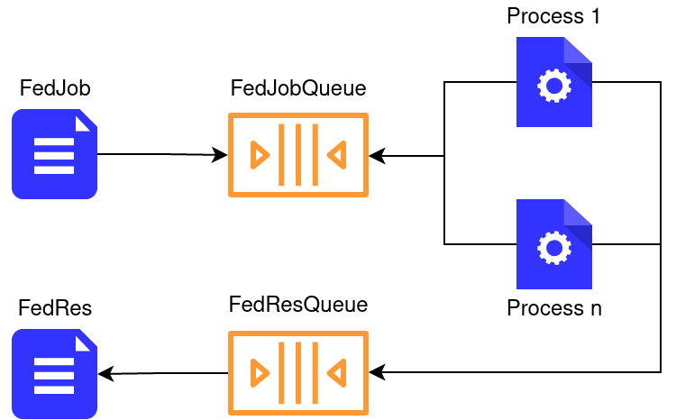

# Simulator
The simulator is in charge of:
- run the simulation loop until a stopping condition is met.
  The stopping condition is defined in the configuration file as:
  ```num_rounds``` or ```acc``` or ```loss```
- initialize the simulation *Status*
- initialize the dataset
- save and export the simulation data to a file

## Status
The status aggregates all the information about the simulation.
It provides complete information about the training, such as
the selected devices, the metrics of the model, the status of
the devices (availability and failures).

## Simulation loop
```
for given number of repetitions:
    init new simulation status
    init federated algorithm with the status
    run the fed. alg. until a stopping condition is met
    save run data
export simulation data
```

## Parallelization
The simulator is built to train multiple models concurrently on separate processes,
in order to maximize the resource allocation minimizing the simulation time.

The number of processes is defined by ```num_processes``` in the configuration file.
The communication between processes is realized by ```multiprocessing.Queue``` using the
consumer/producer pattern.



A ```FedJob``` object is pushed into a the ```FedJobQueue``` every time a new computation
needs to be performed.  The processes perform the fit of the models and return the results
of the computation into a ```FedResQueue``` that is read when all the ```FedJob``` was
completed. The ```FedRes``` contains the result of the computation.