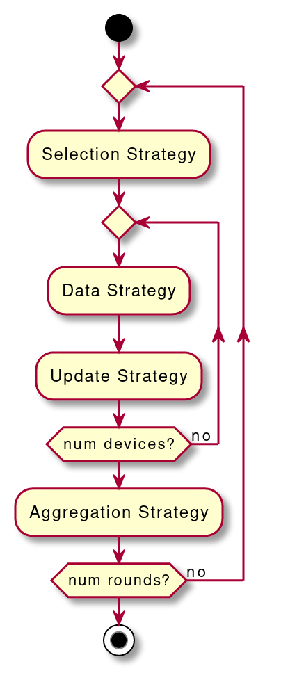

# Strategies Introduction
**FELES** is designed to ease the implementation and test of custom FL algorithms.
Optimizers can be developed and plugged in during the execution of the protocol in a real FL scenario. 

The execution of the optimizers is sketched in the following image:

  

The selection strategy is executed in order to get the devices that will take part to the training or evaluation phase.
For a complete list of available selection strategies see [Selection Strategies](./selection_strategies.md)

The data strategy is executed in order to select the data that will be used for the training or evaluation.
For a complete list of available data strategies see [Data Strategies](./data_strategies.md)

The update strategy is executed in order to set the local update configuration, that is how the local work
will be performed.
For a complete list of available update strategies see [Update Strategies](./update_strategies.md)

The Aggregation strategy is executed after the local updates to aggregate all the local results.
For a complete list of available aggregation strategies see [Aggregation Strategies](./aggregation_strategies.md)

