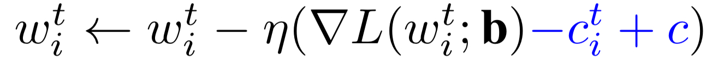

### Training Optimizer
Custom training optimizers are implemented in order to realize the federated algorithms.

#### SCAFFOLD optimizer
The **SCAFFOLD optimizer** corrects the local updates by adding a control variates for the server (c) and parties (ci), 
which are used to estimate the update direction of the server model and the update direction of each client.

